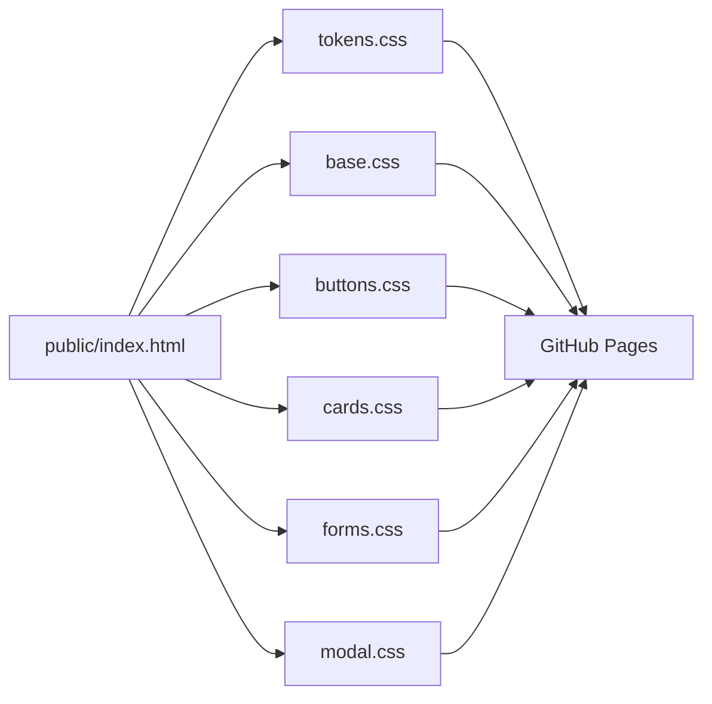

# css-components

> CSS-only component library — buttons, cards, forms, modal, zero JS

[](https://github.com/Prithv122/css-components/actions/workflows/ci.yml)

**Live demo:** https://prithv122.github.io/css-components/
**Stack:** Vanilla HTML5 / CSS3, no framework, no JS, no build step

---

## 1. The problem

Component libraries are usually sold as a reason to reach for a framework or a JS runtime —
even a "modal" is treated as something that needs `useState` and an event listener. This
project is the opposite bet: how much of a real component library (variants, states, a working
modal) can pure CSS carry on its own, with the DOM and the cascade doing the work a framework
usually does. It doubles as a demonstration of CSS features shipping in 2024–2025 browsers
(`:has()`, `:user-invalid`, `@starting-style` + `transition-behavior: allow-discrete`) that most
component-library tutorials still don't use.

## 2. The data

Not applicable — this is a static component showcase, no dataset.

## 3. Architecture



One stylesheet per component, all reading from the same `tokens.css` custom-property layer, no
`@import` (each is a separate `<link>` so the browser fetches them in parallel instead of the
render-blocking waterfall `@import` causes).

## 4. Key decisions & tradeoffs

| Decision | Chose | Over | Why |
|---|---|---|---|
| Modal open/close mechanism | Hidden checkbox + `:checked ~` sibling combinator, toggled by `<label for>` controls | `:target` + URL fragment | `:target` writes to browser history and the URL bar — a shared link with `#demo-modal` already in it would pop the modal open on load. The checkbox keeps all state local to the DOM. |
| Modal backdrop click | Does nothing — only the explicit Cancel/Confirm/× controls close it | Backdrop-as-`<label>` (click-outside-to-close) | With zero JS, making the backdrop a label means clicks *inside* the modal (nested inside that label) also close it, since there's no `stopPropagation`. An always-open modal until an explicit control is clicked is more correct than one that closes on the wrong click. |
| Modal control's accessible name | One `aria-label` on the checkbox itself | Relying on the four associated `<label for>` elements | A form control's accessible name is computed from *every* associated label concatenated — with four labels ("Open modal", "Close", "Cancel", "Confirm") pointing at one checkbox, a screen reader would announce nonsense. `aria-label` overrides that computation; see `NOTES.md`. |
| Stylesheet split | One file per component (`buttons.css`, `cards.css`, …), each linked separately | One `styles.css` | Mirrors how a real component library ships — each piece independently reviewable and, if this ever became a published package, independently importable. |
| Form validation styling | CSS `:user-invalid` (fires only after interaction) | Plain `:invalid` | `:invalid` matches an empty required field immediately on page load, before a visitor has done anything — flags every required field as an error before they've had a chance to fill it in. `:user-invalid` waits until the field has actually been touched. |

## 5. Results

| Metric | Value | Baseline | Notes |
|---|---|---|---|
| Lighthouse Performance | 100 | ≥95 gate | CI-measured, 3-run median, [workflow run](https://github.com/Prithv122/css-components/actions/workflows/ci.yml) |
| Lighthouse Accessibility | 100 | ≥95 gate | Same run |
| Lighthouse Best Practices | 100 | ≥95 gate | Same run |
| Lighthouse SEO | 100 | ≥95 gate | Same run |
| `<script>` tags in the page | 0 | — | Every interaction (button states, card hover, form validation, modal open/close) is CSS-only |
| `html-validate` errors | 0 | — | `html-validate:recommended`, two rules disabled (see project `GUIDELINES.md`) |

## 6. How to run

```bash
git clone https://github.com/Prithv122/css-components.git
cd css-components
npm install
npm run validate
npm run lhci
```

Then open `public/index.html` directly, or serve it (`npx serve public`) to test as GitHub
Pages would. No build step, no `.env`, nothing to configure.

## 7. What I'd change at 100× scale

If this became a real, versioned design system consumed by other teams, the biggest gap is the
modal: a checkbox-driven dialog has no focus trap, no Escape-to-close, and its "backdrop" can't
block interaction with the rest of the page for a screen-reader user the way a real
`role="dialog"` with `aria-modal` and JS-managed focus can. At that scale I'd keep the CSS
(tokens, buttons, cards, forms) exactly as-is — none of that needs JS — and replace only the
modal's control layer with the native `<dialog>` element's `.showModal()`, which gets focus
trapping, Escape, and top-layer stacking for free from the browser instead of hand-rolled CSS.
I'd also add a build step (PostCSS + a minifier) once the component count made hand-maintained
`<link>` tags unwieldy, and publish the CSS files as an npm package with a changelog, the same
way `filetx` shipped to PyPI.

---

## References

- MDN, [`@starting-style`](https://developer.mozilla.org/en-US/docs/Web/CSS/@starting-style) and
  [`transition-behavior`](https://developer.mozilla.org/en-US/docs/Web/CSS/transition-behavior) —
  the mechanism behind the modal's fade transition on a `display: none ↔ flex` toggle.
- The checkbox-hack modal pattern is a long-standing, widely-documented CSS technique (no single
  canonical source); the accessible-name fix (`aria-label` on the checkbox) and the
  backdrop-click tradeoff analysis in `NOTES.md` are this project's own.
